# SRS Diagrams - ระบบจัดการอาหารและโภชนาการ
## แผนภาพและไดอะแกรมสำหรับ Software Requirements Specification

---

## 1. Use Case Diagram

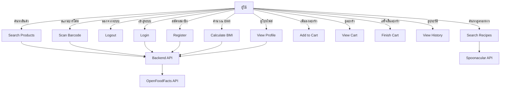

---

## 2. DFD Level 0 (Context Diagram)

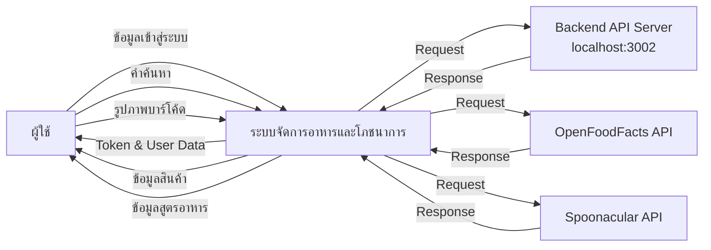

---

## 3. DFD Level 1

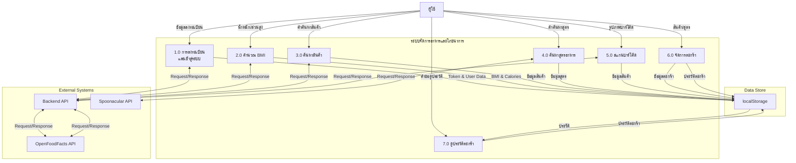

---

## 4. State Diagram

### 4.1 State Diagram - ระบบตะกร้าสินค้า

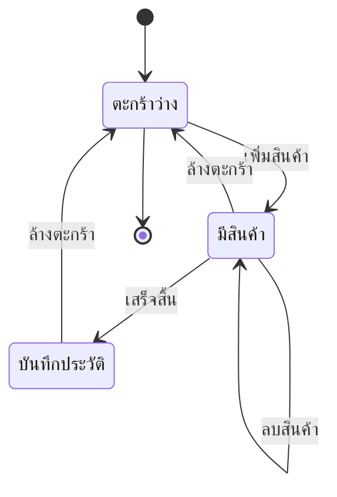

### 4.2 State Diagram - กระบวนการลงทะเบียน

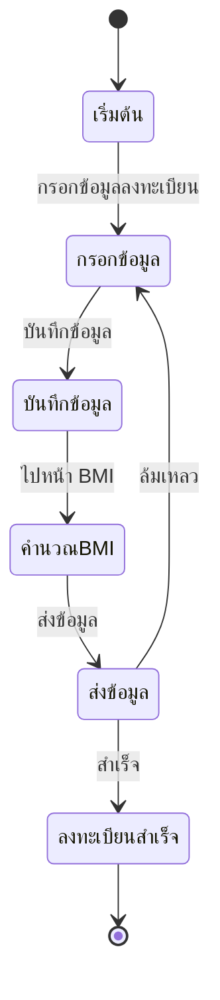

### 4.3 State Diagram - กระบวนการค้นหา

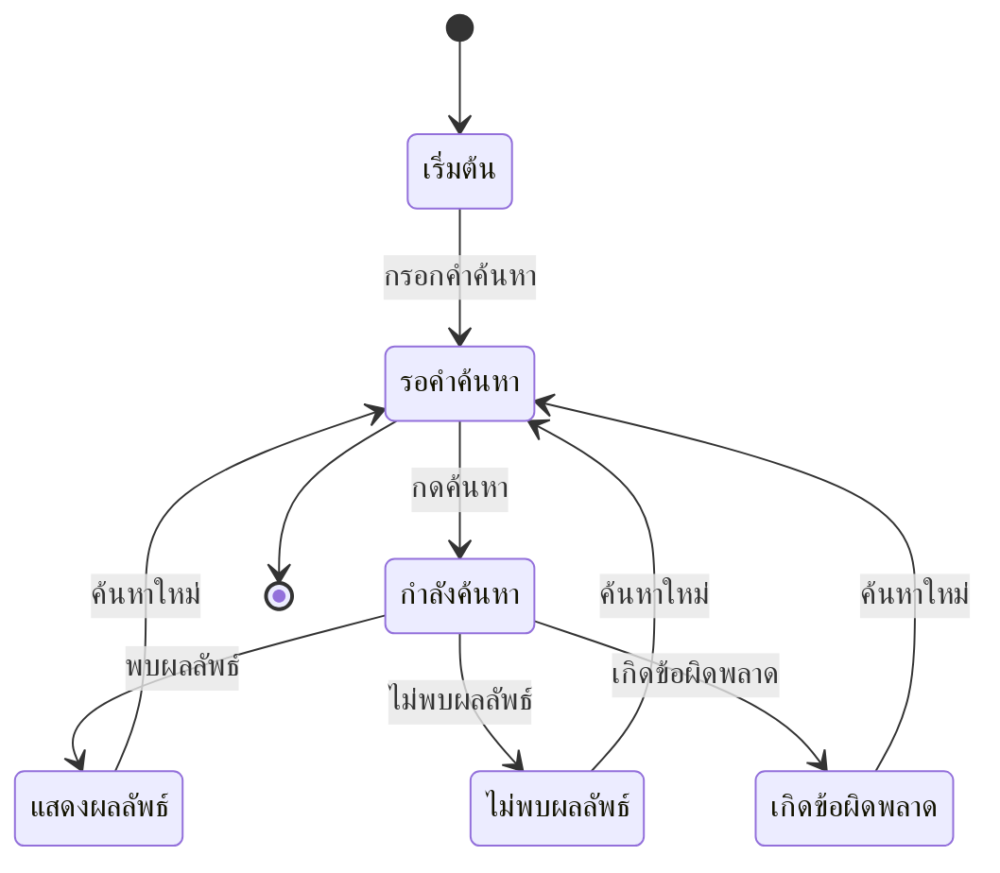

### 4.4 State Diagram - สถานะการเข้าสู่ระบบ

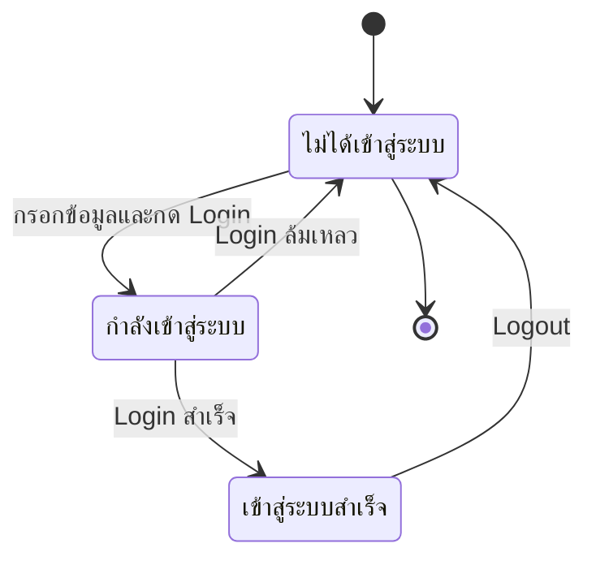

---

## 5. Sequence Diagram

### 5.1 Sequence Diagram - กระบวนการลงทะเบียนและคำนวณ BMI

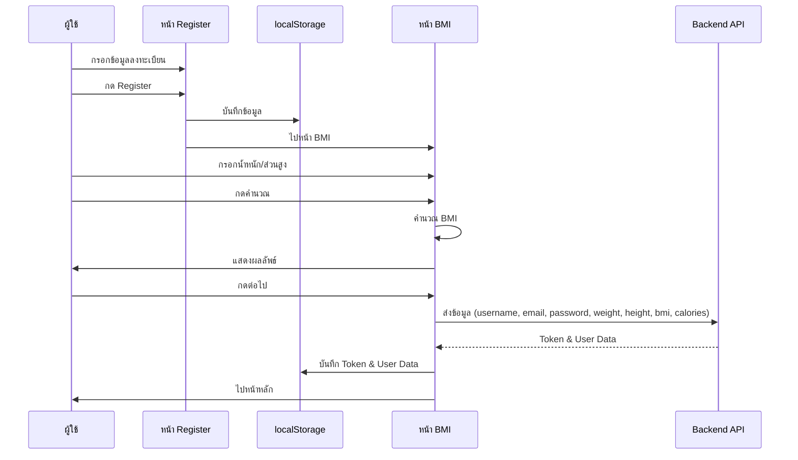

### 5.2 Sequence Diagram - กระบวนการค้นหาสินค้าและเพิ่มลงตะกร้า

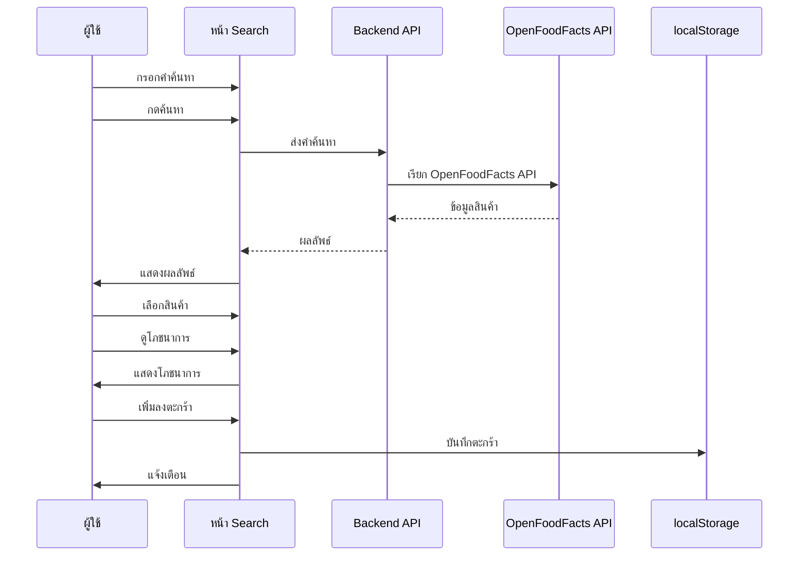

### 5.3 Sequence Diagram - กระบวนการค้นหาสูตรอาหาร

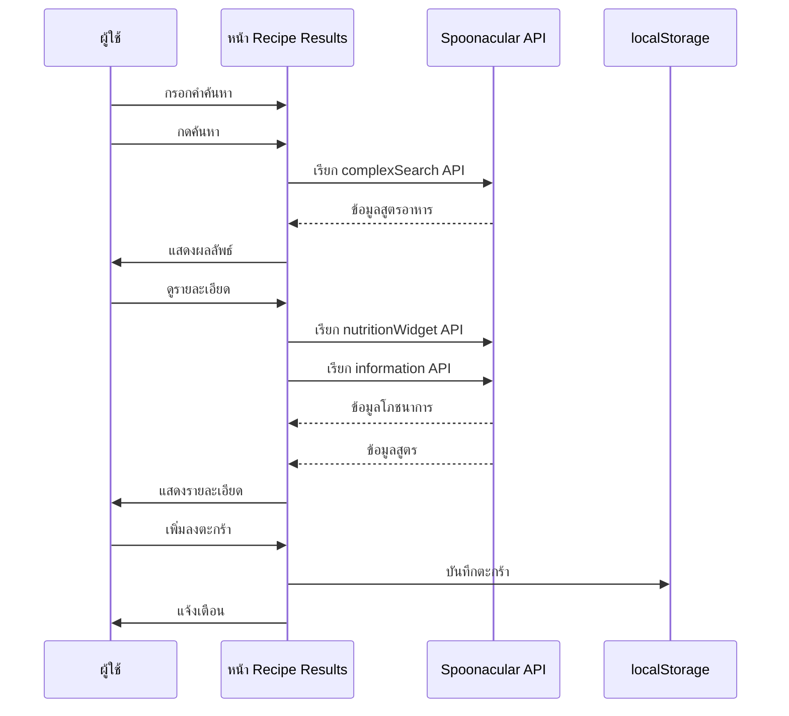

### 5.4 Sequence Diagram - กระบวนการสแกนบาร์โค้ด

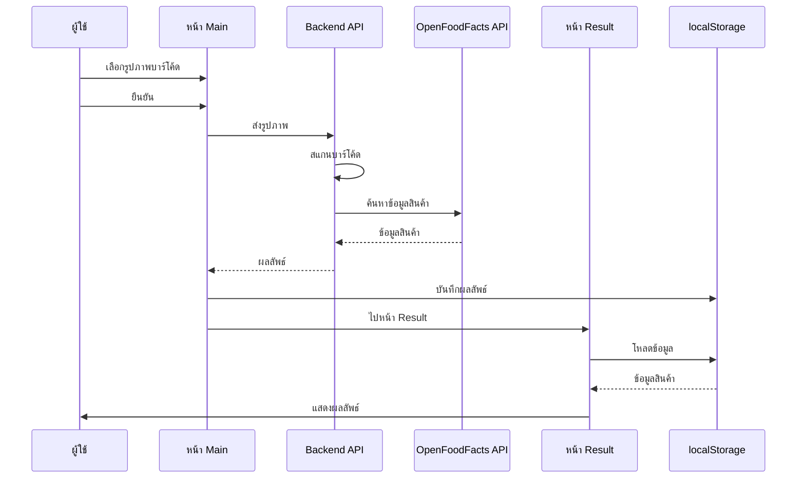

### 5.5 Sequence Diagram - กระบวนการเสร็จสิ้นตะกร้า

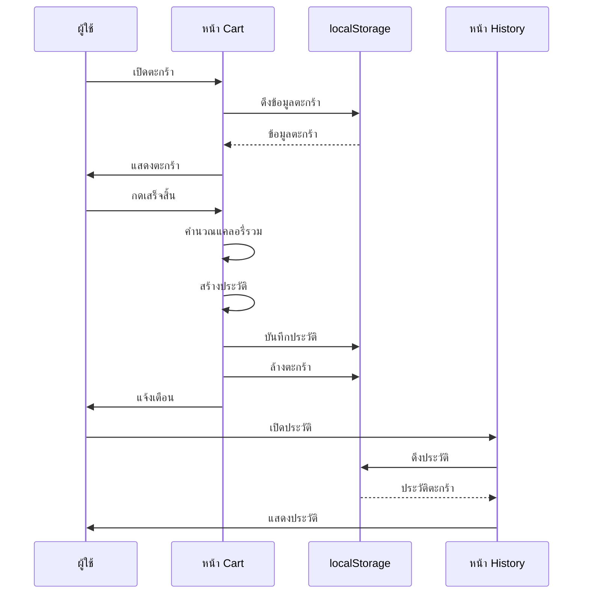

---

## 6. Collaboration Diagram

### 6.1 Collaboration Diagram - กระบวนการค้นหาสินค้า

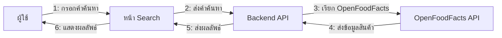

### 6.2 Collaboration Diagram - กระบวนการเพิ่มสินค้าลงตะกร้า

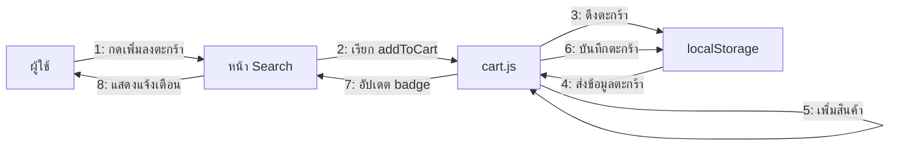

### 6.3 Collaboration Diagram - กระบวนการเสร็จสิ้นตะกร้า

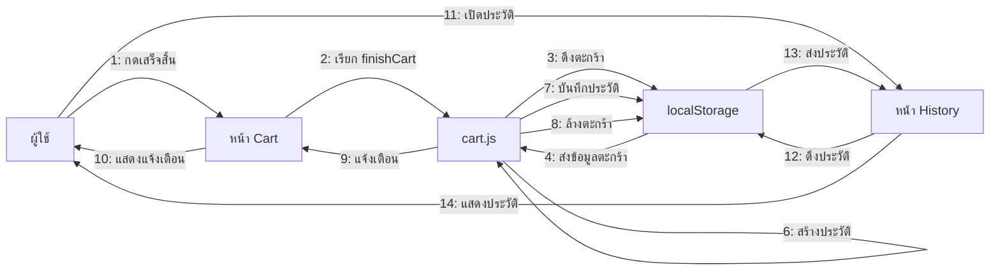

---

## 7. Entity Relationship Diagram (ERD)

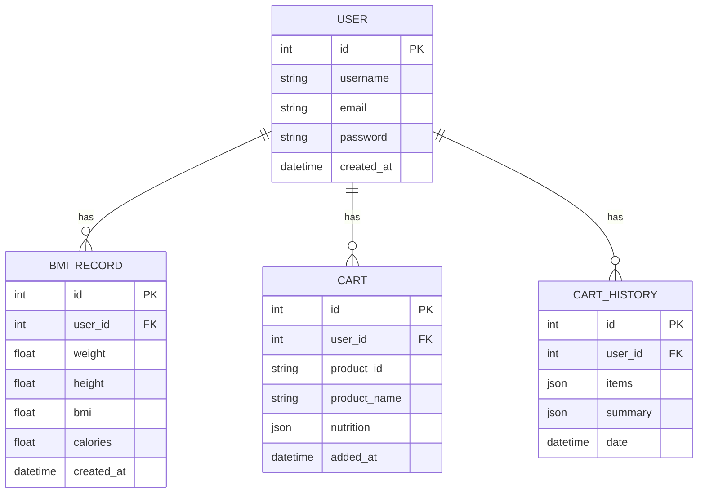

---

## 8. Activity Diagram

### 8.1 Activity Diagram - กระบวนการลงทะเบียน

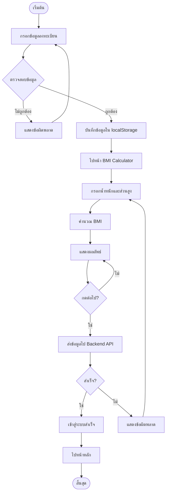

### 8.2 Activity Diagram - กระบวนการค้นหาและเพิ่มลงตะกร้า

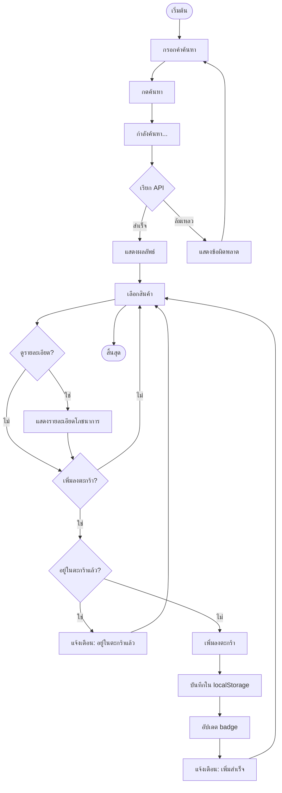

---

## 9. Component Diagram

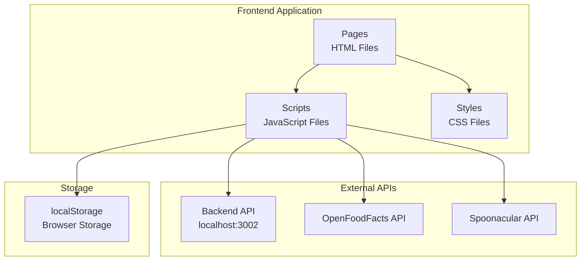

---

## 10. Deployment Diagram

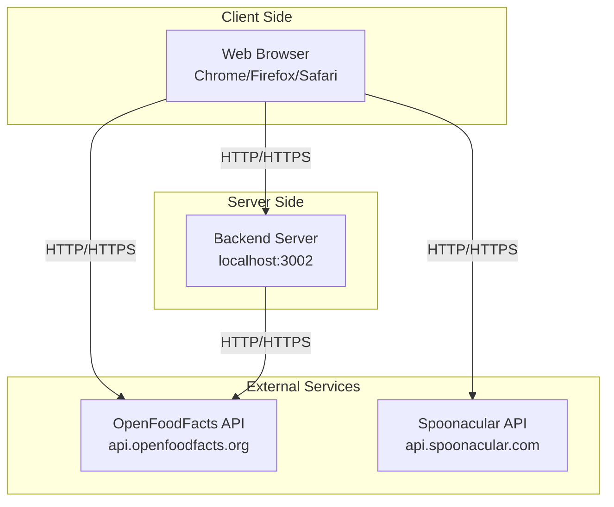

---

## หมายเหตุ

- แผนภาพทั้งหมดใช้ Mermaid syntax ซึ่งสามารถแสดงผลได้ใน Markdown viewers ที่รองรับ
- สำหรับการแสดงผลในเอกสาร สามารถใช้เครื่องมือเช่น:
  - GitHub (รองรับ Mermaid)
  - VS Code with Mermaid extension
  - Online Mermaid Editor: https://mermaid.live/
  - Markdown viewers ที่รองรับ Mermaid

